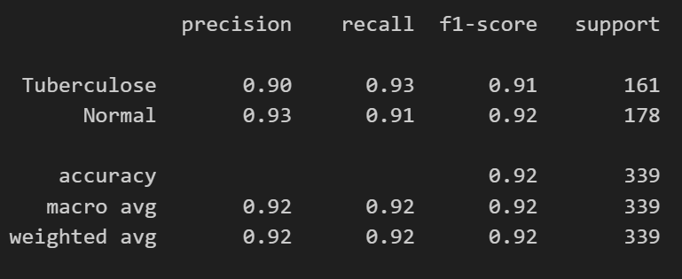
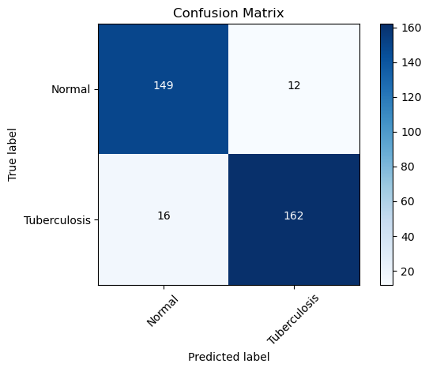
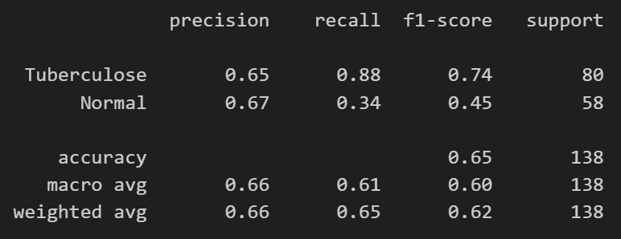
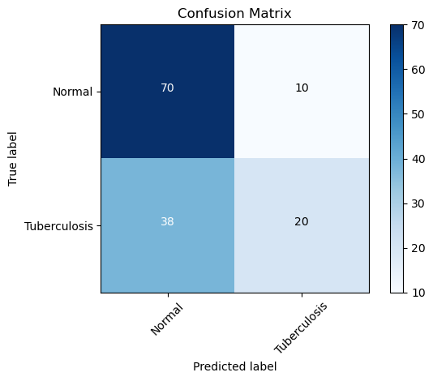

# Vision Computer Experiments VGG16 Changes

## Table of Contents

- [About](#about)
- [Datasets](#datasets)
- [Experiment](#model)
- [Conclusion](#conclusion)

## About 

O experimento trata-se de propor alterações na VGG16 e utiliza-la para executar classificação binária em datasets de Tuberculose. 

## Datasets 

No experimento foi utilizado as bases Shenzhen dataset contendo 662 imagens, Montgomery dataset contendo 128 imagens e partes Tbx11 dataset contendo 1600 imagens, sendo 800 para Normal e 800 para Tuberculose.
Montgomery foi utilizado como a base que não participa do treinamento para ter uma visão da utilização real.
A rede treinou com um conjunto de 2262 imagens sendo (Tuberculose, Normal):
- 1583 para treino com a divisão de (804 T,  779 N).
- 340 para validação com a divisão de (154 T, 186 N).
- 339 para teste com a divisão de (178 T, 161 N).

### Model propose 

Para montar a rede foi utilizado as biblioteca da Tensor Flow, 
as ideias de alteração foram:
- Substituir os blocos iniciais  da vgg por blocos “mb_conv” da efficient Net para um downsample mais otimizado a custo de precisão.
- Antes do output padrão da vgg adicionar um ou mais blocos inception permitir que o modelo aprenda representações mais ricas e complexas.

### Experiments

Os parâmetros das Redes 
- Total params: 37,461,573 VGG + MB_Conv + Inception - tempo de execução de uma época 12S 
- Total params: 54,837,441 VGG + MB_Conv - tempo de execução de uma época 18S 
- Total params: 44,162,221 VGG + Inception - tempo de execução de uma época 21S 
- Total params: 134, 338, 387 VGG - tempo de execução de uma época 26S

|  | |
|:---:|:---:|
| TEMPO | PARAMS |

### Results

- Resultados da VGG BASE

|  |  |
|:---:|:---:|
| LOSS | ACCURACY |

- Resultados da BASE_MBCONV

|  |  |
|:---:|:---:|
| LOSS | ACCURACY |

- Resultados da BASE_MBCONV_INCEPTION

|  |  |
|:---:|:---:|
| LOSS | ACCURACY |

- Resultados da Predicoes com BASE_MBCONV_INCEPTION

|  |  |
|:---:|:---:|
| METRICAS DO TESTE | MATRIZ DE CONFUSAO DO TESTE |

- Resultados com a MONT com BASE_MBCONV_INCEPTION

|  |  |
|:---:|:---:|
| METRICAS DO MONT | MATRIZ DE CONFUSAO DO MONT |

## Conclusion 

Apesar dos resultados a VGG16 continua sendo melhor devido a estabilidade de seu aprendizado, mas as alteracoes nao apresentaram resultados ruins com  tamanho e tempo de execucoes menores.

If you use the data here for a publication, please consider citing the following papers:

  # TBX11K dataset
  @inproceedings{liu2020rethinking,
    title={Rethinking computer-aided tuberculosis diagnosis},
    author={Liu, Yun and Wu, Yu-Huan and Ban, Yunfeng and Wang, Huifang and Cheng, Ming-Ming},
    booktitle={IEEE/CVF Conference on Computer Vision and Pattern Recognition},
    pages={2646--2655},
    year={2020}
  }

  # DA and DB datasets
  @article{chauhan2014role,
    title={Role of gist and PHOG features in computer-aided diagnosis of tuberculosis without segmentation},
    author={Chauhan, Arun and Chauhan, Devesh and Rout, Chittaranjan},
    journal={PloS One},
    volume={9},
    number={11},
    pages={e112980},
    year={2014},
    publisher={Public Library of Science}
  }

  # Montgomery and Shenzhen datasets
  @article{jaeger2014two,
    title={Two public chest X-ray datasets for computer-aided screening of pulmonary diseases},
    author={Jaeger, Stefan and Candemir, Sema and Antani, Sameer and W{\'a}ng, Y{\`\i}-Xi{\'a}ng J and Lu, Pu-Xuan and Thoma, George},
    journal={Quantitative Imaging in Medicine and Surgery},
    volume={4},
    number={6},
    pages={475},
    year={2014},
    publisher={AME Publications}
  }
